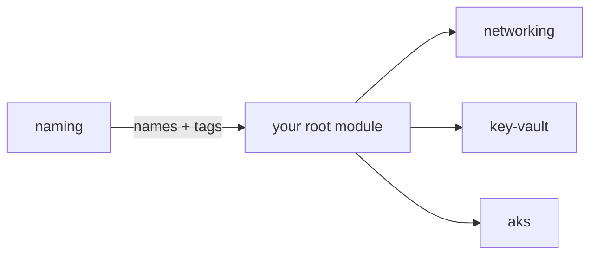

# terraform-azure-modules

[](https://github.com/jmsalvo/terraform-azure-modules/actions/workflows/ci.yml)

A small collection of versioned, tested Terraform modules for Azure. Each module
is deliberately narrow, documented with `terraform-docs`, exercised by native
`terraform test`, and released under a single repo-wide semantic version.

This is the warm-up repo of a larger portfolio; it also sets the conventions
(layout, CI, README shape, testing) reused by the other repos.

## Modules

| Module | Purpose | Status |
|--------|---------|--------|
| [`naming`](modules/naming) | Deterministic Azure resource names and a merged tag map. No providers, no API calls. | Available |
| [`networking`](modules/networking) | Virtual network, subnets, and optional per-subnet NSGs. | Available |
| `key-vault` | Key Vault with access model and diagnostics. | Planned |
| `aks` | Hardened AKS cluster. | Planned |

## How modules relate



Modules are **composed in the root module**, not nested. `naming` produces the
names and tags; the root module passes them into `networking` / `key-vault` /
`aks` as plain values. Each module stays single-purpose and independently
testable.

## Quickstart

```hcl
module "naming" {
  source = "github.com/jmsalvo/terraform-azure-modules//modules/naming?ref=v0.1.0"

  workload    = "shop"
  environment = "prod"
  location    = "eastus2"
}

resource "azurerm_resource_group" "this" {
  name     = module.naming.names["resource_group"]
  location = "eastus2"
  tags     = module.naming.tags
}
```

Pin `?ref=` to a released tag. `main` is not a stable interface.

## How it's tested

CI (`.github/workflows/ci.yml`) runs on every PR and on `main`, with **no cloud
credentials**:

| Check | Tool |
|-------|------|
| Formatting | `terraform fmt -check -recursive` |
| Static validity | `terraform validate` (every module and example) |
| Lint | `tflint` + azurerm ruleset |
| Behaviour + input validation | `terraform test` (`.tftest.hcl` per module) |
| IaC misconfiguration scan | `trivy config` |
| Docs freshness | `terraform-docs` inject + diff check |
| Integration example | one Terratest suite (`test/`) against the no-provider `naming` example |

## Security considerations

- Modules pin `required_version` and provider version ranges.
- CI needs no secrets and no Azure identity; nothing in this repo authenticates
  to a cloud.
- `trivy config` scans module HCL for insecure defaults on every change.
- Provider-backed modules (networking, key-vault, aks) will ship with secure
  defaults — private endpoints, no public network access, diagnostics on — and
  document every knob that widens exposure.

## Teardown

The modules here create nothing on their own. `terraform test` and the Terratest
example run fully offline (the `naming` module has no providers) and leave no
state. Consuming root modules own their own `terraform destroy`.

## Versioning

Repo-wide semantic version: one tag (`vMAJOR.MINOR.PATCH`) covers every module.
Consumers pin `?ref=<tag>`. See
[ADR 0001](docs/decisions/0001-repo-wide-versioning.md) for the rationale and the
conditions under which this would move to per-module versioning.

Changes are recorded in [`CHANGELOG.md`](CHANGELOG.md).

## Contributing

See [`CONTRIBUTING.md`](CONTRIBUTING.md). PR-based workflow, Conventional Commits,
CI green before merge.

## License

[MIT](LICENSE) © 2026 Jennifer Salvo
